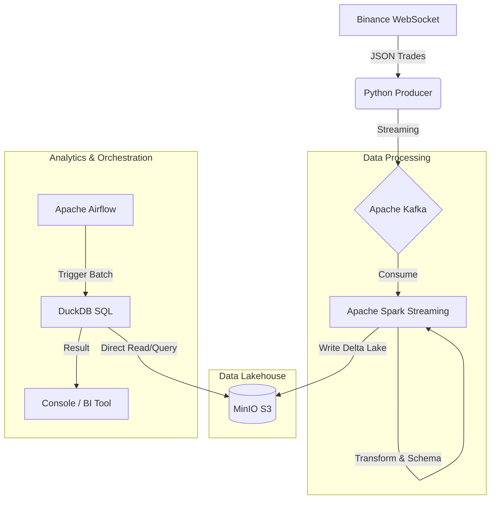

# 🚀 Real-time Crypto Data Lakehouse Pipeline


## 📌 Project Overview
This project is an end-to-end **Modern Data Engineering Pipeline** that ingests real-time cryptocurrency trading data (BTCUSDT) from the Binance WebSocket API, streams it through Apache Kafka, processes it using Apache Spark (Structured Streaming), and stores it in a MinIO-based **Data Lakehouse** using the **Delta Lake** format. Finally, it uses **DuckDB** orchestrated by **Apache Airflow** to perform fast analytical SQL queries directly on the lakehouse.

## 🏛️ Architecture



## 🛠️ Tech Stack
- **Data Ingestion:** Python, `websocket-client`, `kafka-python-ng`
- **Message Broker:** Apache Kafka, Zookeeper
- **Stream Processing:** Apache Spark (PySpark), Spark Structured Streaming
- **Storage (Lakehouse):** MinIO (S3-compatible), Delta Lake
- **Analytics:** DuckDB, `deltalake` python library
- **Orchestration:** Apache Airflow
- **Infrastructure:** Docker, Docker Compose

## 📁 Project Structure
```text
ecommerce-lakehouse-pipeline/
├── dags/                     # Airflow DAGs
│   └── crypto_aggregation_dag.py
├── data/                     # Local data mapping
├── jobs/                     # Spark and Analytics Jobs
│   └── process_to_lakehouse.py
├── scripts/                  # Data Ingestion scripts
│   └── crypto_realtime_ingestion.py
├── docker-compose.yml        # Infrastructure setup
├── requirements.txt          # Python dependencies
└── README.md                 # Project Documentation
```

## 🚀 How to Run the Pipeline

### 1. Prerequisites
- Docker & Docker Desktop installed and running.
- Python 3.9+ installed locally.

### 2. Start the Infrastructure
Spin up Kafka, Spark, MinIO, and Airflow using Docker Compose:
```bash
docker-compose up -d
```
*Wait approximately 1-2 minutes for all services (especially Airflow) to fully initialize.*

### 3. Setup MinIO Bucket
1. Open MinIO Console at `http://localhost:9001`
2. Login with:
   - **Username:** `admin`
   - **Password:** `password`
3. Go to **Buckets** and create a new bucket named `lakehouse`.

### 4. Start Real-Time Data Ingestion
Install dependencies and run the Python producer to stream Binance trades into Kafka:
```bash
pip install -r requirements.txt
python scripts/crypto_realtime_ingestion.py
```

### 5. Start Spark Structured Streaming
Open a **new terminal window** and submit the PySpark job *inside* the Spark container to process Kafka streams and write to MinIO:
```bash
docker exec -it spark-master spark-submit \
  --packages org.apache.spark:spark-sql-kafka-0-10_2.12:3.5.1,io.delta:delta-spark_2.12:3.2.0,org.apache.hadoop:hadoop-aws:3.3.4 \
  /opt/bitnami/spark/jobs/process_to_lakehouse.py
```

### 6. Run Batch Analytics with Airflow & DuckDB
1. Open the Airflow Web UI: http://localhost:8081
2. Login with `airflow` / `airflow_password`
3. Trigger the `crypto_lakehouse_analytics` DAG.
4. This DAG will use **DuckDB** to query your Delta Lake, calculate aggregations, and automatically save the results into the **PostgreSQL** Serving Layer (table: `crypto_summary`).

### 7. Visualize with Power BI
1. Open **Power BI Desktop**.
2. Click **Get Data** -> **PostgreSQL database**.
3. Connect with:
   - **Server:** `localhost:5432`
   - **Database:** `airflow`
   - **User:** `airflow`
   - **Password:** `airflow_password`
4. Load the `crypto_summary` table and create your interactive dashboard!

## 📊 Analytics Output Example
Using DuckDB to query the Delta Lake directly without a database engine:
```text
==================================================
 📈 CRYPTO MARKET SUMMARY (BATCH ANALYTICS)
==================================================
  symbol  total_trades     avg_price  total_volume_usd
 BTCUSDT           142  64320.150000        1458231.50
==================================================
```

---
*Created as part of a Data Engineering Portfolio.*
